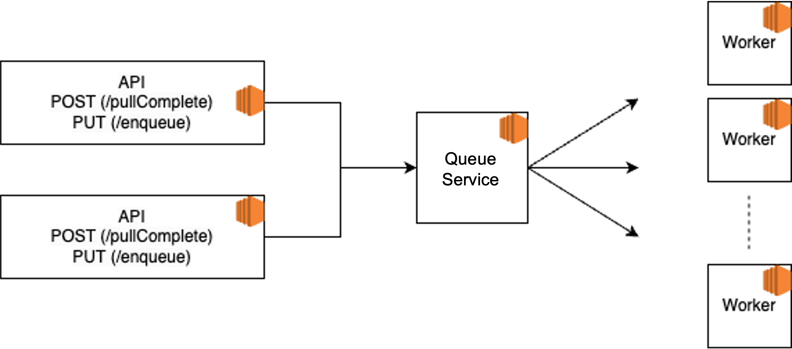

# Cloud Computing Exe2 - Dynamic Workload


## Members

Daniel Sehaik 308223965

Linoy Elimeleh 319122610

Harel Damari 305792020


---

## Architecture
Our architecture contains 3 services:

###API Service 

2 running instances responsible to transfer request from user to orchestrator service.

####Endpoints:
**/enqueue?iterations=num (PUT)**

Send data to be processed by server.

Example response:

```json
{
    "job_id": 304321712267898212899395949001364170436
}
```

**/pullCompleted?top=num (POST)**

Returns the latest completed work items (the final value for the work and the work id). We added "completed_at" (UTC) as well.

Example Response:
```json
[
 {
        "job_id": 137971701816193109278194344554660777512,
        "completed_at": "2023-06-18 22:22:03.052208",
        "hash": "b'\\xd8\\x1c\\x82RWeXt\\x99iS1\\xc8P\\x11o\\xe0pA.\\xc6\\xb3\\x91\\xa8uX$\\x02\\x997\\x7f\\xa6\\xd6Fz\\x13\\xf2jQ\\xbc\\x1e\\x1c\\xf2\\xc9\\xbe\\x1d_\\xdbQ\\x8f\\x9ds\\x1e>j\\xf7{(\\xc9\\x1d\\xfatu\\xf8'"
    },
    {
        "job_id": 298317975309890583778194365162919819958,
        "completed_at": "2023-06-18 22:22:04.061205",
        "hash": "b'\\xcf\\x17\\xc6c\\xb2x\\xcb}\\x8d\\xf3\\xc8`\\xceY\\x02\\xa4\\xd1\\x9ck\\xfc\\x1a\\xa9!a#\\x11\\xc2L\\xba\\xe1<]H\\xedX\\xdb\\xae\\x9f\\xa7\\x93\\xb6\\x8fN5\\xdc\\xd7\\xc5\\x9b\\x8aCSO4\\xa5v\\xec\\xa5\\xeep{\\x9b\\\\Ly'"
    },
    {
        "job_id": 151771594307708939804112481042340456223,
        "completed_at": "2023-06-18 22:22:05.070520",
        "hash": "b'4\\xb4\\x91\\x92&:\\xc3\\x86\\xc9\\xa3\\x1e\\x82f\\x1f\\x18p\\xc8\\xab\\x85\\xc2\\xc8K\\xfet\\x18\\x9a\\\\\\xda\\x80\\xccq\\t\\x9e\\xe1MaJ\\xc5@\\xaa\\xea\\x956\\xc4#\\n\\xce\\x0e\\xd9\\x03<I\\xda\\x947\\x00A\\xdcM\\x88\\xd7&J\\xcf'"
    }
]
```
### Orchestration Service 

Processes all requests and scales workers to manage API load. MAX_TIME_IN_QUEUE - configures the maximal amount of time allowed to keep jobs in queue before scaling up.

####Endpoints:
**/job/enqueue (PUT)** - Add new job to work queue.

**/job/completed (GET)** - return the latest completed work items.

**/job/completed (PUT)** - Add completed work to memory.

**/job/consume (GET)** - Consume job from queue to be processed.

###Worker Service

This is the component responsible for the job itself. When we scale up the number of workers we can process more parallel jobs.
The workers consume jobs, process them and send the result to orchestration service.
When amount concurrent jobs decreases and workers are free we scale down to reduce number of workers.
This auto up/down scaling allows us utilize cloud's flexability and common resources and by doing so saving money.



---

## How to run?
Run the "deploy.sh" script to deploy all instances.
Make sure bash and AWS CLI exist on your machine.
After instances are up, can validate using AWS console or AWS CLI, 
You should have 4 running instances: 2 API's, 1 Orchestrator and 1 Worker.
When load increases the number of workers should increase as well while remaining the minimum of 1 worker.


---
## Failure Modes

### Single Point of Failure
Our orchestrator is a single point of failure. If for some reason this instance fails we won't be able to process new jobs.
To mitigate this issue we would scale this service so if some instance fails there is always another one running.

### Disaster Recovery
Our data is not persisted and kept in memory. In real production system we won't be able to recover data if the orchestrator fails or in case one worker fail during process.
Moreover, the deployment is across a single DS (depends on aws configuration), which exposes our services to DS disaster risk.
To handle this issue we would deploy our services over multiple DS and would use a distributed DB to persist data.

### Worker Failure
Our communication with wokers is fully synchronous. In case of worker failure we wol lose a workload.
One of the methods which can be used to mitigate this is not to remove non-complete messages / adding them to some "in-process" queue.
Another and great way to handle this is using some stream processing framework such as kafka streams.
Using Kafka our jobs will be persisted and replicated. We can then use kafka streams exactly once semantics to mitigate the risk of lost jobs:
https://www.confluent.io/blog/exactly-once-semantics-are-possible-heres-how-apache-kafka-does-it/

### Horizontal Scaling
Currently, if some instance fails we have no guarantee for it to spawn back.
Moreover, deploying a new version will require end users to change host.
This can be handled using a container orchestration system such as K8S and ingress.
For auto scaling we can use HPA (https://kubernetes.io/docs/tasks/run-application/horizontal-pod-autoscale/).

### Vertical Scaling - Memory / CPU
Choosing proper resources for an instance is an art for itself. Currently, we used default t2 instance for all services.
In real world we would like to tune our resources taking into account current and future loads.

### Monitoring & Alerts
One of the most important things in server side development. Real world production systems require monitoring - we should monitor api calls, error codes, requests, instance failures, metrics (timers/counters/gauges).
Moreover, it would be great to integrate ELK we can add logs that can filtered using kibana. We could also add trace/session id's so we can search flows across multiple services.
For handling metrics we can use prometheus and grafana and would add alerts to be sent to mail/phone/work messenger.

### Testing
In real world system we would expect the code to be fully tested with unit and integration tests.
We would also suggest including automation tests to check the entire flow and automated load testing as this project should handle increasing loads.

### Security
We did not expose any credential during our project. 
Nonetheless, cyber threats are a real issue dealing with production system and a DO/Cyber team should mitigate this issue and make sure that by using rules and policies they mitigate the attack surface as much as possible.
